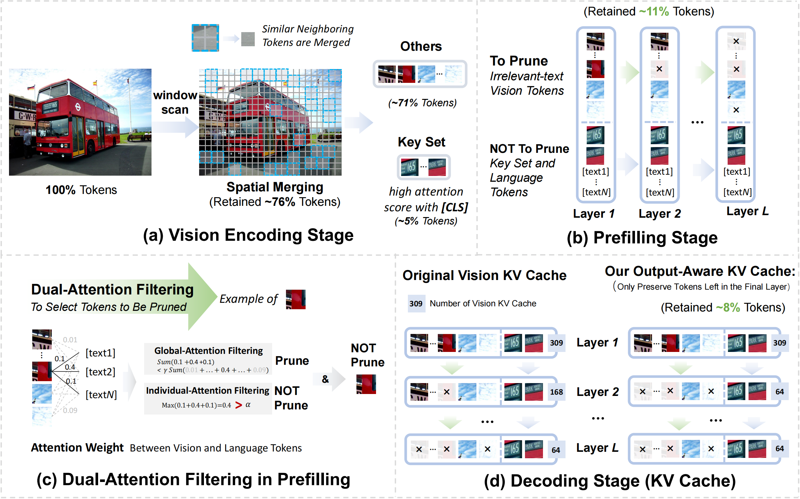
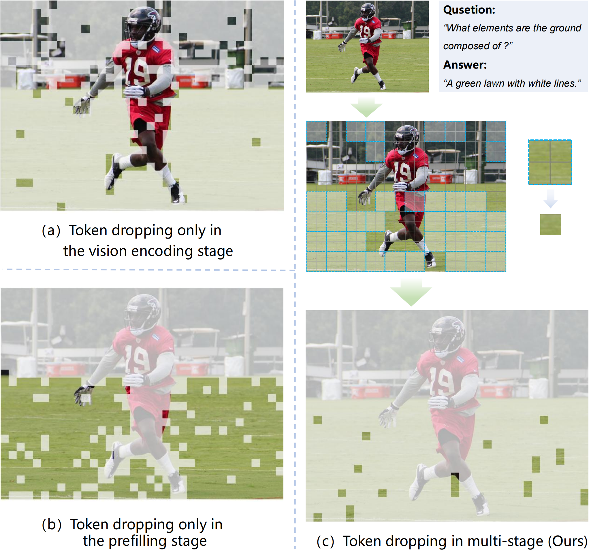

<div align="center">

<h1> Multi-Stage Vision Token Dropping: Towards Efficient Multimodal Large Language Model </h1>

<h5 align="center"> 

[Ting Liu]()<sup>1* </sup>,
[Liangtao Shi]()<sup>2*</sup>,
[Richang Hong]()<sup>2</sup>,
[Yue Hu]()<sup>1</sup>,\
[Quanjun Yin]()<sup>1✉️</sup>,
[Linfeng Zhang]()<sup>3✉️</sup>

<sup>1</sup>National University of Defense Technology, <sup>2</sup>Hefei University of Technology,\
<sup>3</sup>Shanghai Jiao Tong University

<p>
<a href='https://arxiv.org/abs/2411.10803'></a>

</h5>
</div>

<p align='center'>

</p>

## 👀 Overview

The vision tokens in multimodal large language models usually exhibit significant spatial and temporal redundancy and take up most of the input tokens, which harms their in ference efficiency. To solve this problem, some recent works were introduced to drop the unimportant tokens during in ference where the importance of each token is decided only by the information in either the vision encoding stage or the prefilling stage. In this paper, we propose Multi-stage Token Dropping (MustDrop) to measure the importance of each token from **the whole lifecycle**, including the vision encoding stage, prefilling stage, and decoding stage. Comparison of vision token dropping methods: (a) methods that only drop tokens during the vision encoding stage, i.e., PruMerge and ToMe, (b) methods that remove tokens limited to the prefilling phase, i.e., FastV and SparseVLM, and (c) our Mustdrop approach, which gradually removes invalid tokens during the vision encoding, prefilling, and decoding stages.

<div align=center>

</div>

## 👨 Preparation

1. Clone this repository.
```bash
git clone https://github.com/liuting20/MustDrop.git
cd MustDrop
```

2. Install necessary package
```Shell
 conda env create -f environment.yaml      
 pip install -r requirements.txt
```

3. Download Multimodal Benchmark

Please follow the detailed instruction in [LLaVA-Evaluation](https://github.com/haotian-liu/LLaVA/blob/main/docs/Evaluation.md).

## 🎯 Usage
Specifically, `--sparse` in script indicates whether to perform sparseness, while `--scale` and `--bias` control the degree of token sparsity.

1. Example for evaluating MME results (192 tokens, scale = 13.5, bias = 0.0):
```Shell
CUDA_VISIBLE_DEVICES=0 bash scripts/v1_5/eval/mme.sh
```

2. Example for evaluating TextVQA results (64 tokens, scale = 0.8, bias = 0.0):
```Shell
CUDA_VISIBLE_DEVICES=0 bash scripts/v1_5/eval/textvqa.sh
```

## License

This project is released under the [Apache 2.0 license](LICENSE).

## Citation

If you use MustDrop in your research, please cite our work by using the following BibTeX entry:
```bibtex
@article{liu2024multi,
  title={Multi-Stage Vision Token Dropping: Towards Efficient Multimodal Large Language Model},
  author={Liu, Ting and Shi, Liangtao and Hong, Richang and Hu, Yue and Yin, Quanjun and Zhang, Linfeng},
  journal={arXiv preprint arXiv:2411.10803},
  year={2024}
}

```
## Acknowledgment

We extend our gratitude to the open-source efforts of [LLaVA](https://github.com/haotian-liu/LLaVA), [SparseVLMs](https://github.com/dvlab-research/MGM) and [VideoLLaVA](https://github.com/PKU-YuanGroup/Video-LLaVA).
